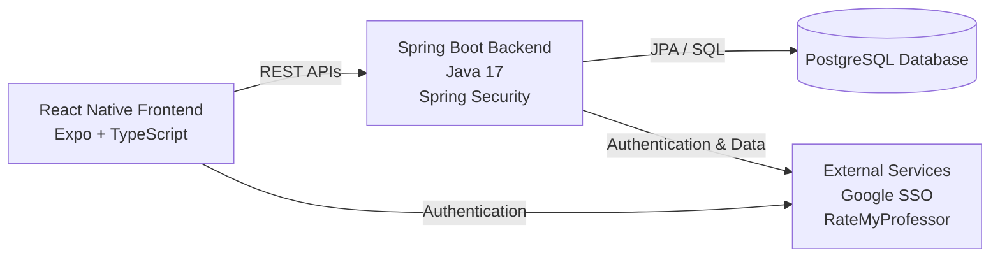

# CourseFlow
CourseFlow is a degree-planning application built for Iowa State University students to plan their coursework, visualize prerequisites, and build semester schedules. The project was developed as a senior design project using a React Native frontend and Spring Boot backend.

## Features
### Degree Planning
    * Build and manage a multi-semester degree plan
    * Track completed, planned, and remaining courses
    * Monitor progress toward degree requirements
### Prerequisite Visualization
    * View course prerequisites as an interactive graph
    * Understand prerequisite relationships between courses
    * Identify courses that need to be completed before enrolling in others
### Smart Scheduler
    * Create semester schedules based on selected courses and requirements
    * Organize courses across semesters while considering prerequisites and credit requirements
### Course Information
    * View course details, prerequisites, and related information
    * Search and explore available courses
### RateMyProfessor Integration
    * View professor information and ratings when planning courses
### Advisor Tools
    * Advisors can view their advisees and review student degree plans
    * Plan Review provides a centralized way to evaluate student schedules and progress
### Authentication
    * Iowa State Net-ID authentication using Google SSO
    * Protected backend endpoints using Spring Security
      
## Tech Stack
### Frontend
* React Native
* Expo
* TypeScript
* React Navigation
* AppAuth
  
### Backend
* Java 17
* Spring Boot 3.5
* Spring Security
* REST APIs
  
### Database
* PostgreSQL
  
### Development
* Git / GitHub
* VS Code
* Expo

## Architecture
CourseFlow uses a client-server architecture. The React Native application communicates with the Spring Boot backend through REST APIs, while the backend handles business logic, authentication, and database operations.

## Application Flow
The frontend is responsible for the mobile user experience, navigation, course planning interfaces, prerequisite visualization, and schedule management.

The Spring Boot backend provides REST APIs and handles:
* Business logic
* Authentication and authorization
* Course information
* Degree plans
* Scheduling
* Advisor functionality
* Plan reviews
* Database operations

PostgreSQL stores application data including courses, degree plans, user information, and scheduling data.

## Project Structure
CourseFlow/
├── frontend/
│   ├── app/ 
│   ├── components/
│   ├── screens/
│   ├── services/
│   └── ...
│
├── backend/
│   ├── src/
│   │   └── main/
│   │       ├── java/
│   │       └── resources/
│   └── ...
│
└── README.md

## Getting Started
### Prerequisites
Make sure the following are installed:
* Node.js
* npm
* Java 17
* Maven
* PostgreSQL
* Expo CLI
* Android Studio or an iOS development environment
  
### Clone the Repository
git clone <repository-url>
cd CourseFlow

### Backend Setup
Create a PostgreSQL database for the application and configure the backend connection properties.
Create an application.properties or application.yml configuration containing the required database and authentication settings.

Example:
spring.datasource.url=jdbc:postgresql://localhost:5432/courseflow
spring.datasource.username=<username>
spring.datasource.password=<password>

Start the Spring Boot server:
./mvnw spring-boot:run

### Frontend Setup
Navigate to the frontend directory and install dependencies:
cd frontend
npm install

Start the Expo development server:
npx expo start

The application can then be launched using an Android emulator, iOS simulator, or compatible physical device.

## Authentication
CourseFlow uses Iowa State Net-ID authentication through Google SSO. Authentication is handled on the mobile client and secured on the backend using Spring Security.
Authentication configuration is intentionally excluded from the repository. Environment-specific credentials and application properties should be configured locally.

## API
The backend exposes REST endpoints for functionality including:
* Course information
* Degree plans
* Scheduling
* Advisor functionality
* Plan reviews
* Authentication and user information

Example endpoint structure:
/api/courses
/api/plan
/api/schedule
/api/advisor

## Development
CourseFlow was developed as a collaborative senior design project.
Development involved:
* Designing frontend screens and user flows
* Implementing REST APIs
* Connecting the application to PostgreSQL
* Integrating authentication
* Implementing degree-planning functionality
* Building prerequisite visualization
* Developing scheduling functionality
* Iterating on features based on project requirements
* Coordinating changes across the frontend and backend to maintain consistent API contracts and application behavior

The project provided experience working across a full-stack application while collaborating on a shared codebase.

## Future Improvements
Potential future improvements include:
* More advanced automated schedule generation
* Improved degree requirement validation
* Expanded course and professor data
* Additional advisor functionality
* More personalized scheduling recommendations
* Improved handling of university-specific degree requirements

License
This project was developed as part of an Iowa State University senior design project. See the repository for project-specific usage and licensing information.
